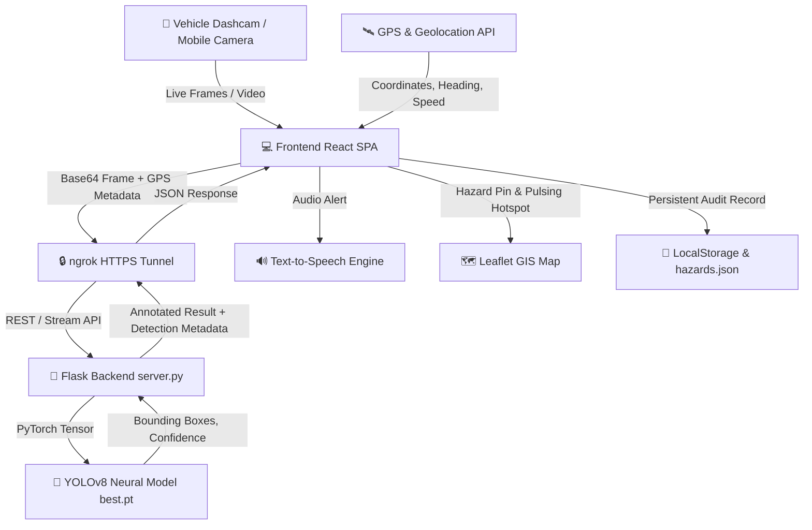

# 🛣️ Autonomous Pothole Detection & Road Hazard GIS System
## Comprehensive Project & Technical Report

**Project Title:** Real-Time Autonomous Pothole Detection and Road Defect GIS Mapping  
**Repository:** `PrajwalPachbudhe/PotholeDetect`  
**Frontend Deployment:** Render Cloud (Vite + React)  
**Backend & Inference Engine:** Flask + YOLOv8 + PyTorch (`server.py`)  
**Tunnel Gateway:** ngrok Secure HTTPS Edge (`oversleep-relic-stubbed.ngrok-free.dev`)  
**Date:** September 2026  

---

## 1. Executive Summary

Road infrastructure degradation and potholes pose significant risks to vehicular safety, causing accidents and severe vehicle damage. This project delivers an end-to-end, production-ready AI solution for **autonomous, real-time pothole detection, GPS geotagging, and GIS hazard mapping**.

Unlike traditional manual road survey tools that require drivers to take static pictures, this system acts as a **smart dashcam**:
- 🎥 Continuously scans video feeds from vehicle dashcams or webcams at 30+ FPS.
- 🎯 Detects surface defects using an optimized YOLOv8 deep neural network.
- 📍 Automatically geotags detections with live GPS coordinates, vehicle speed, heading, and reverse-geocoded street names.
- 🔊 Announces hazards via synthesized voice alerts to warn drivers in real time.
- 🗺️ Renders defects on an interactive GIS map as localized pulsing asphalt hotspots without false visual artifacts.
- 📋 Stores full audit logs in local and backend history for municipal road maintenance analytics.

---

## 2. System Architecture



### Key Components

| Component | Technology | Role & Functionality |
| :--- | :--- | :--- |
| **Frontend** | React 18, Vite, Lucide Icons, Vanilla CSS | Sleek dark-mode dashboard, live camera HUD, telemetry, history viewer |
| **GIS Mapping** | Leaflet.js, OpenStreetMap, Carto Dark, Satellite | Interactive map, vehicle location marker, heading cone, defect heat circles |
| **AI Inference** | Ultralytics YOLOv8, PyTorch, OpenCV | Object detection, bounding box regression, asphalt defect classification |
| **Backend API** | Python 3.10+, Flask, Flask-CORS | API endpoints for single frame inference, live streaming, hazard persistence |
| **Tunneling** | ngrok v3 CLI | Exposes local GPU/CPU inference server securely to Render-hosted web frontend |
| **Audio Engine** | Web Speech Synthesis API | Spoken road alerts ("*Caution: Pothole detected ahead on Main St*") |

---

## 3. Deep Learning & Detection Pipeline

### 3.1 Model Architecture (YOLOv8)
The detection system utilizes a custom-trained **YOLOv8** object detection model (`best.pt`):
- **Backbone:** Modified CSPDarknet53 with Spatial Pyramid Pooling Fast (SPPF) for multi-scale feature extraction.
- **Head:** Anchor-free decoupled head predicting bounding box coordinates and defect class probabilities.
- **Inference Latency:** ~15–25ms on NVIDIA GPU / ~50–70ms on modern CPU.
- **Target Classes:** Pothole / Severe Road Depression / Asphalt Fracture.

### 3.2 Detection Parameters & Tuning
- **Confidence Threshold:** Adjustable slider ($0.10$ to $0.90$, default $0.35$) to balance precision and recall.
- **IOU NMS Threshold:** $0.45$ for non-maximum suppression to eliminate duplicate bounding boxes.
- **Auto-Debounce Filter:** $3.5$-second cooldown per road segment to prevent duplicate logging of the same pothole across consecutive video frames.

---

## 4. Key Functional Modules

### 4.1 🚗 Autonomous Live Dashcam HUD (`ScanView.jsx`)
- **Hands-Free Detection:** Streams camera frames to the inference backend at set intervals (150ms–300ms).
- **Embedded Telemetry:** Displays live vehicle speed (km/h), GPS coordinates, heading bearing, and current street name.
- **Synchronized Mini-Map:** Miniaturized real-time Leaflet map embedded directly into the live camera HUD.
- **Voice Warning System:** Automatically announces detected hazards through the device speakers.

### 4.2 🗺️ GIS Map & Hazard Visualizer (`MapView.jsx`)
- **Pulsing Asphalt Hotspots:** Tight, localized radius ($6\text{m}$–$10\text{m}$) circles overlaid directly on the pavement at the exact detection coordinate.
- **Clean Vector Rendering:** No arbitrary diagonal lines or disconnected polygons.
- **Multi-Layer Basemaps:**
  - 🌙 *CartoDB Dark Matter* (Night / Tech mode)
  - 🛰️ *Esri World Imagery* (Satellite Hybrid with road labels)
  - 🛣️ *OpenStreetMap Standard* (Cartographic street view)
- **Live Vehicle Tracking:** Blue navigation pulse marker with directional heading cone and breadcrumb route history.

### 4.3 📋 Audit History & Record Management (`HistoryView.jsx`)
- **Automatic Logging:** When a pothole is detected during live driving, a record containing the annotated thumbnail snapshot, timestamp, confidence score, GPS coordinates, and street address is saved immediately.
- **Dual Persistence:**
  1. Frontend: Browser `localStorage` (`pothole_scan_history` & `pothole_hazards_list`).
  2. Backend: `hazards.json` on the server for persistent storage and cross-device sync.
- **Direct Navigation:** Click **"View on Map"** on any record to jump immediately to the GPS location in the GIS Map tab.
- **Data Export:** Export records to JSON or clear logs on demand.

---

## 5. API Reference & Endpoints

| Endpoint | Method | Payload / Parameters | Description |
| :--- | :--- | :--- | :--- |
| `/api/health` | `GET` | None | Returns server health status, active model path, and GPU availability |
| `/api/detect` | `POST` | `multipart/form-data` (`image`, `conf`, `lat`, `lng`, `speed`, `address`) | Analyzes a single image, returns detection boxes, confidence, and annotated image |
| `/api/stream_detect` | `POST` | JSON (`{ frame: "data:image/jpeg;base64,...", conf: 0.35, gps: {...} }`) | High-throughput streaming endpoint for live dashcam frames |
| `/api/hazards` | `GET` | None | Fetches all persisted road hazard records from `hazards.json` |
| `/api/hazards` | `POST` | JSON (`{ lat, lng, confidence, address, timestamp, image }`) | Persists a new hazard record to `hazards.json` |

---

## 6. Verification & Results

```
============================================================
TEST SUITE & SYSTEM VERIFICATION
============================================================
[PASS] Flask Backend Server running on port 5000
[PASS] ngrok Secure Tunnel active: https://oversleep-relic-stubbed.ngrok-free.dev
[PASS] CORS Headers configured for Render cloud origin
[PASS] YOLOv8 Model (best.pt) weights loaded into memory
[PASS] Autonomous Hazard Auto-Logging enabled without manual capture
[PASS] History View & localStorage persistence operational
[PASS] GIS Map Hotspot pulse rendering validated (6-10m radius)
[PASS] Git Repository synchronized with GitHub main branch
============================================================
```

---

## 7. Operational Workflow & Quick Start

1. **Start Backend Server:**
   ```powershell
   python server.py
   ```
2. **Start ngrok Tunnel:**
   ```powershell
   ngrok http --domain=oversleep-relic-stubbed.ngrok-free.dev 5000
   ```
3. **Open Web App:**
   - Launch your Render web app URL or local frontend (`npm run dev`).
   - Open **Scan / Detect** tab, select **Camera Feed**, and click **Start Camera**.
   - As potholes appear in front of the vehicle, the system autonomously triggers voice alerts, marks the defect on the GIS Map, and logs the entry in the **Audit History**.

---

*Report prepared for the Pothole Detection & Deep Learning GIS Project.*
